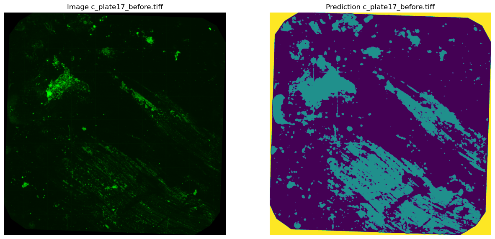
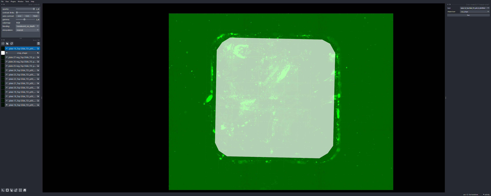

<h1>Biofilm detection in metal explants using APOC pixel classifiers</h1>

<h2>Raw Data Download</h2>

1. [Contact Me](mailto:alberto.d.sanchez@ntnu.no) to obtain a fresh working S3 bucket pre-signed link.

2. Paste the link inside <code>0_data_download.ipynb</code> notebook after <code>presigned_url</code>.

3. Run the notebook to download and extract the data. The resulting data folder contains all the raw_data, training data, shapes used for manually cropping your area of interest and the resulting cropped images used in this example.

<h2>Data Pre-Processing Steps</h2>

1. Notebook <code>1_raw_data_processing.ipynb</code> takes the <code>data/raw_data</code> folder structure and extracts the tiled images obtained from an EVOS 2 microscope.

2. Using the [napari-crop](https://github.com/BiAPoL/napari-crop) tool that can be found in Napari Assistant under Tools > Utilities you can load a predefined shape (stored under <code>data/biofilm_train/crop_shape.csv</code>), load an image from <code>data/processed</code> and crop it manually.

3. The manually cropped images generated for this particular analysis are stored under <code>data/cropped</code>.

<h2>APOC Training</h2>

1. <code>0_train_APOC_on_folders.ipynb</code> shows how to train your own Accelerated Object and Pixel (semantic) [APOC classifiers](https://github.com/haesleinhuepf/apoc) to tell biofilm from background. An example of how to generate the needed sparse labelling and using Napari-Assistant can be found [here](https://github.com/adiezsanchez/intestinal_organoid_brightfield_analysis/blob/main/1_train_and_setup.ipynb).

2. The ground truth annotations used in this particular analysis can be found under <code>data/biofilm_train/images</code> and <code>data/biofilm_train/masks</code>.

<h2>Image Analysis</h2>

<h2>Environment setup instructions</h2>

1. In order to run these Jupyter notebooks and .py scripts you will need to familiarize yourself with the use of Python virtual environments using Mamba. See instructions [here](https://biapol.github.io/blog/mara_lampert/getting_started_with_mambaforge_and_python/readme.html).

2. Then you will need to create a virtual environment using the following command:

   <code>mamba create -n biofilm devbio-napari python=3.9 pyqt -c conda-forge</code>

3. I recommend going through the Jupyter notebooks (.ipynb) files in order to familiarize yourself with Napari (image viewer) and the script functionalities.
